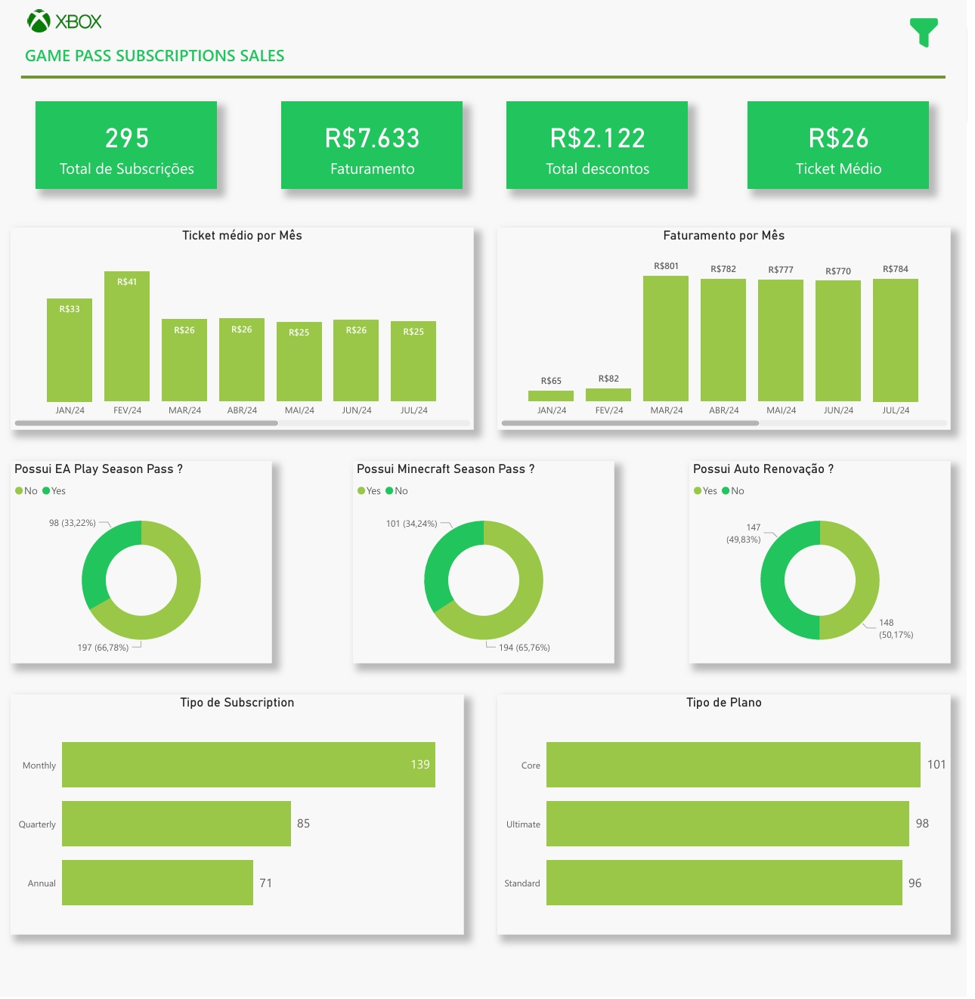

# 🎮 Game Pass Subscriptions Sales Dashboard

Dashboard desenvolvido no **Power BI** com base em uma base **fictícia** de vendas de assinaturas do **Game Pass**, com foco em análise de performance, faturamento e comportamento de clientes.

---

## 📊 Objetivo do Projeto

Analisar os principais indicadores de vendas de assinaturas, identificando:
- Evolução do faturamento ao longo do tempo
- Ticket médio mensal
- Adoção de planos e tipos de subscription
- Impacto de descontos
- Comportamento de renovação automática e season passes

Projeto desenvolvido com foco em **boas práticas de modelagem, DAX e visualização de dados**.

---

## 🗂️ Estrutura dos Dados

- Base fictícia em Excel
- Tabela fato de vendas
- Criação de tabela calendário (`D_Calendario`)
- Relacionamento em modelo estrela

---

## 📈 Principais KPIs

- **Total de Subscrições**
- **Faturamento**
- **Total de Descontos**
- **Ticket Médio**
- Faturamento por mês
- Ticket médio por mês
- Distribuição por tipo de plano e subscription
- Adoção de recursos adicionais (EA Play, Minecraft)
- Renovação automática

---

## 🛠️ Ferramentas Utilizadas

- Power BI Desktop
- DAX
- Modelagem de Dados
- Excel (base fictícia)

---

## 📷 Preview do Dashboard

---

## 📁 Arquivos do Projeto

- Base de dados: `/data/game_pass_subscriptions_sales.xlsx`
- Dashboard Power BI: `/dashboard/dashboard_powerbi.pbix`
- Dashboard em PDF: `/dashboard/dashboard_preview.pdf`

---

## 🚀 Observações

Este projeto faz parte do meu portfólio como **Analista de Dados**, com foco em Power BI, modelagem e storytelling com dados.

Feedbacks são bem-vindos!
